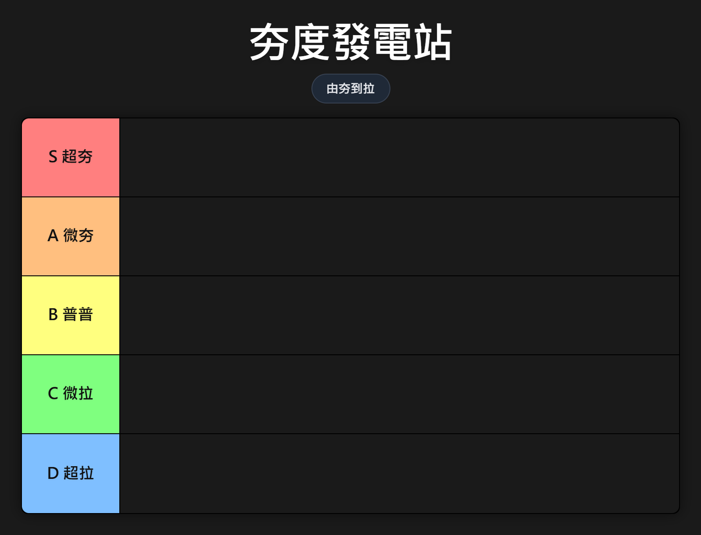

# 🏆 迷因評比製造所 | Meme Tier List Maker

> 給聚會現場主揪用的 Tier List 製造器，快速把大家的哏變成圖。

## 🎯 一句話定位

**自訂層級 → 匯入卡片 → 排版美化 → 匯出大圖或 QR Code 分享**  
不是一般的 Tier List 工具，而是「聚會現場的梗圖生產器」。

## ✨ 核心特色

- 🎚️ **完全自訂層級** — 標籤、顏色、分數自由設定
- 🃏 **卡片超靈活** — 可上傳圖片、貼網址、旋轉縮放、雙擊編輯
- 🔤 **128 種字體** — 從思源黑體到重金屬，中日英都有
- 📋 **12 組內建迷因模板** — 夯度、辣度、厭世度…一鍵套用
- 📦 **一鍵打包專案** — 所有設定、卡片、圖片打包成 JSON，匯入即還原
- 📱 **QR Code 分享** — 掃碼打開同一份評比表，聚會輪流接手編輯
- 🖼️ **高畫質匯出** — PNG/JPEG 可選，支援 1x/2x/3x 倍率，可內嵌 QR
- ⚙️ **全域設定面板** — 卡片大小、圓角、佈局方向、背景遮罩、匯出格式
- ↩️ **完整復原/重做** — Ctrl+Z / Ctrl+Y，歷史步數可調
- 📱 **手機可用** — 支援行動端拖放、多選模式不需鍵盤

## 🚀 馬上使用

### 線上版
> 放在 GitHub Pages 上的網址
> https://Niwi7yming4.github.io/rank-it/

### 本機使用
直接下載 `index.html`，用瀏覽器打開即可，**不需要安裝任何東西**。

## 🛠️ 技術棧

| 技術 | 用途 |
|------|------|
| React (via Babel) | UI 框架 |
| Tailwind CSS | 樣式 |
| Lucide Icons | 圖示 |
| html-to-image | 匯出 PNG/JPEG |
| qrcode-generator | 離線 QR Code 產生 |
| Mobile Drag Drop | 手機拖放支援 |
| Google Fonts | 128 種字體 |

## 📄 授權

MIT License

## 🤝 貢獻

歡迎開 Issue、發 PR，或分享你創作的爆笑評比圖！
